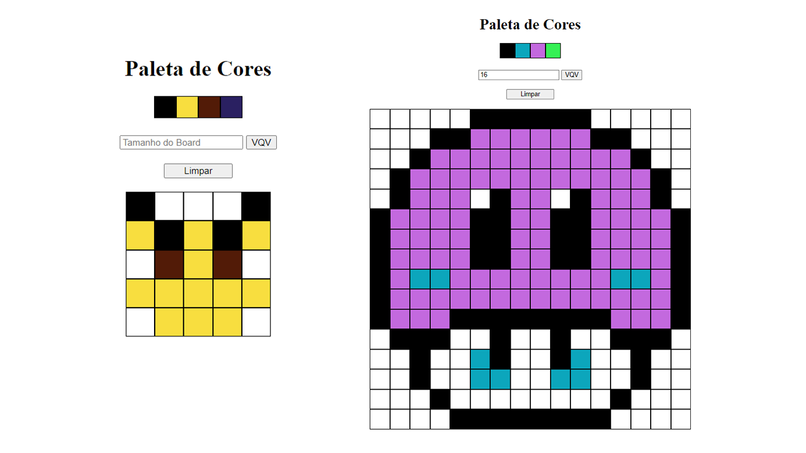

# Pixel Art Tool - HTML, CSS e JavaScript

[](https://sonarcloud.io/summary/new_code?id=vitorbss12_PixelArtTool-HTML-CSS-JavaScript)
[](https://sonarcloud.io/summary/new_code?id=vitorbss12_PixelArtTool-HTML-CSS-JavaScript)
[](https://sonarcloud.io/summary/new_code?id=vitorbss12_PixelArtTool-HTML-CSS-JavaScript)
[](https://sonarcloud.io/summary/new_code?id=vitorbss12_PixelArtTool-HTML-CSS-JavaScript)

Esse projeto é uma ferramenta simples para criar pixel arts, dada uma paleta de cores e um quadro composto por pixels. É possível testar a aplicação aqui: [Pixel Art Tool](https://vitorbss12.github.io/PixelArtTool-HTML-CSS-JavaScript/).


<b>Demonstração Pixel Art Tool</b>

## Conteúdo

- [Recursos Pixel Art Tool](#recursos)
  - [Paleta de Cores](#paleta-de-cores)
  - [Tamanho do Quadro](#tamanho-do-quadro)
  - [Limpar Quadro](#limpar-quadro)
  - [Quadro](#quadro)
- [Linguagens](#linguagens)
- [Ferramentas](#ferramentas)
  - [Linter](#linter)
- [Instruções](#instrucoes)
  - [Instalação](#instalacao)
  - [Execução](#execucao)
- [Observações](#observacoes)

<a id="recursos"></a>

# **Recursos Pixel Art Tool**

<a id="paleta-de-cores"></a>

### **Paleta de Cores**

A aplicação utiliza uma paleta de cores com quatro cores, a primeira sempre será preta enquanto as demais são geradas aleatoriamente sempre que a aplicação é atualizada.

<a id="tamanho-do-quadro"></a>

### **Tamanho do Quadro**

O quadro pode ser customizado de acordo com o usuário através do campo de texto de tamanho do quadro. É possível alterar a dimensão do quadro entre 5x5 e 20x20. O tamanho padrão é 5x5 e alertas de erro são exibidos caso o usuário digite um valor inválido.

<a id="limpar-quadro"></a>

### **Limpar Quadro**

O botão de limpar serve apenas para limpar o quadro, mas não altera a paleta de cores ou o tamanho do quadro.

<a id="quadro"></a>

### **Quadro**

O quadro é composto por pixels, cada pixel se inicia com a cor branca, e conforme for clicado, o pixel tem a cor alterada de acordo com a cor selecionada na paleta de cores.

<a id="linguagens"></a>

# **Linguagens**

`HTML` é utilizado para estruturar a aplicação, `CSS` é utilizado para estilizar a aplicação e `JavaScript` é utilizado para executar os recursos da aplicação.

<a id="ferramentas"></a>

# **Ferramentas**

<a id="linter"></a>

### **Linter**

Este projeto foi desenvolvido utilizando o linter `ESLint` seguindo as boas práticas definidas na [Trybe](https://www.betrybe.com/).

<a id="intrucoes"></a>

# **Instruções**

<a id="instalacao"></a>

### **Instalação**

O projeto não necessita instalação para ser executado. A instalação só é necessária para o linter que é opcional. Caso seja do interesse do usuário, o linter pode ser instalado através do comando:

```
npm install
```

<a id="execucao"></a>

### **Execução**

O projeto pode ser executado através do arquivo `index.html` que está na raiz do projeto.

<a id="observacoes"></a>

# **Observações**

- Este é um projeto de estudo desenvolvido durante minha formação na [Trybe](https://www.betrybe.com/). :rocket:

- Este repositório está sendo monitorado pelo [SonarCloud](https://sonarcloud.io/) para avaliação de qualidade.

- Quer saber mais sobre mim? Veja o meu [LinkedIn](https://www.linkedin.com/in/vitorbss/).
